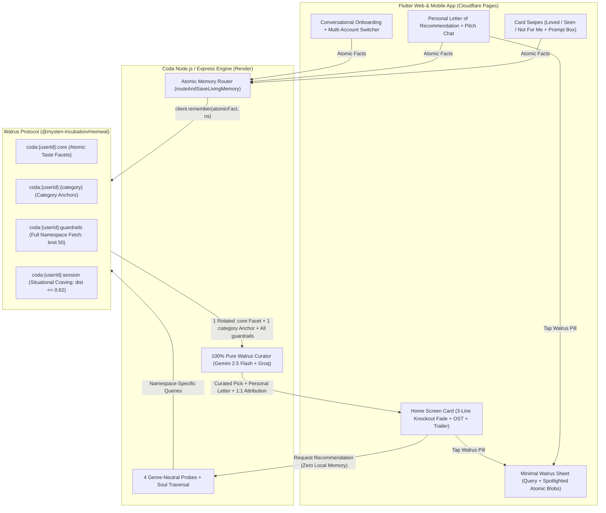

# 🦭 Coda — Personal Media Taste Curator

> **Built for the Walrus Memory Hackathon (Walrus Session 8: Chatbots That Remember)**  
> **Tracks**: Build a Chatbot with Walrus Memory • Beyond the Big Two (Google Gemini + Groq) • Project Documentation & Technical Bug Findings  
> 🌐 **Live Web & PWA App (Cloudflare Pages)**: **[https://coda-88k.pages.dev](https://coda-88k.pages.dev)**  
> ⚡ **Live Curation & Walrus Engine (Render)**: **[https://coda-personal-media-taste-curator.onrender.com](https://coda-personal-media-taste-curator.onrender.com)**

**Coda** is an intentional, conversational media taste curator for **Movies, Anime, TV Shows, Video Games, Books, Visual Novels, and Manga**. Instead of burying you under soulless algorithmic grids, Coda acts like that one deeply perceptive friend who actually remembers who you are—delivering **one high-conviction pick at a time**, complete with its atmospheric soundtrack playing softly in the background, a preview trailer, and a personal letter of recommendation grounded **100% in your decentralized Walrus Protocol Memory**.

---

## ✨ The Philosophy: Why Choosing What to Experience Should Feel Like an Experience

Think about the stories that have shaped your life—the film you watched at 2 AM that left you staring at the ceiling as the credits rolled, the anime whose soundtrack still gives you goosebumps years later, the novel or game that carried you through a quiet season of your life.

**Choosing what art to let into your head isn't a utility task. It's an emotional ritual.**

Yet today, discovering what to watch, play, or read feels completely broken:
- **Streaming & Storefront Paralysis**: You open Netflix, Steam, or Crunchyroll on a tired evening, scroll past 400 noisy thumbnails for 45 minutes, feel nothing, and close the app.
- **Soulless AI Lists**: You ask a standard chatbot for a recommendation, and it spits out a sterile, bulleted Wikipedia list of the same 10 mainstream blockbusters it gives to everyone else on earth. It doesn't know what made you laugh last week, that you love kinetic action choreography *and* warm romantic comedies as distinct moods, or that you've already seen *John Wick* three times.

### Coda Makes the Discovery Itself an Experience
1. **One Intentional Pick at a Time**: No infinite grids. No paradox of choice. Coda presents a single, full-bleed glassmorphic artwork card chosen specifically for *you*.
2. **Sensory Immersion Before You Commit**: As soon as a card appears, its **original soundtrack (OST)** swells gently in the background so you can *feel* its atmosphere immediately, with a one-tap **trailer preview** right on the card.
3. **A Personal Letter, Not a Synopsis**: Instead of a generic plot summary, Coda writes a two-paragraph personal letter connecting the work's pacing, humor, action, or emotional texture directly to the atomic memories recalled from your Walrus soul.
4. **A Curator That Grows With Every Action**: Every conversation, every swipe, and every note you type into Coda's feedback prompt box is permanently woven into your decentralized taste graph on Walrus.

---

## 🧠 How Walrus Memory Powers Every Single Surface of Coda

Coda is not a media app with a memory feature bolted on—**Walrus Memory (`@mysten-incubation/memwal`) is the entire cognitive engine of the app.** During recommendations, Gemini receives **zero local memory fallback**: 100% of the taste facets, favorite benchmarks, dealbreakers, and watched/rejected history come live from Walrus Protocol. Without Walrus Memory, Coda is completely blind.

Here is how Walrus Memory drives every surface of the Coda experience:

### 1. Conversational Onboarding (Building the Foundation of Your Soul)
- Onboarding is the foundation of Coda. Instead of a sterile genre checklist, Coda has a natural voice/text conversation with you to uncover what stories move you, what makes you laugh, what thrills you, and what you avoid.
- On every turn, Coda extracts **self-contained, atomic memory facts**—never gluing unrelated tastes (like *"I love kinetic action"* and *"I love romantic comedies"*) into a single muddy string—and writes them as separate SEAL-encrypted blobs across your partitioned Walrus namespaces (`:core`, `:<category>`, `:guardrails`).
- Tapping **Remembered on Walrus** under any Coda onboarding response opens the minimal Walrus sheet showing the exact atomic facts just sealed to your namespaces alongside their live `blob_id` / `job_id`.

### 2. The Recommendation Engine (4 Genre-Neutral Probes + Soul Traversal + Full `:guardrails`)
When curating a recommendation for any media tab, Coda executes a multi-stage Walrus retrieval pipeline with **zero local memory input**:
1. **4 Genre-Neutral Dynamic Probes**: Rather than biasing toward a single mood, Coda rotates across 4 genre-neutral probes so comedy, kinetic action, romance, sci-fi, and drama all surface naturally:
   - *Probe 1 (General Taste & Genres)*: `"What types of <media> and genres is the user interested in to <watch/read/play>?"`
   - *Probe 2 (Favorite Titles & Creators)*: `"Which favorite <media> titles, directors, studios, or creators does the user love?"`
   - *Probe 3 (Tone, Humor, Action & Style)*: `"What tone, humor, action, pacing, or storytelling style does the user enjoy in <media>?"`
   - *Probe 4 (Situational / Time-of-Day Habit)*: `"What kind of <media> does the user like to <watch/read/play> in the <morning/afternoon/evening/late night>?"`
2. **Namespace-Specific Querying (Never One Generic Query Everywhere)**:
   - `coda:<userId>:core` is queried for core taste facets and genres.
   - `coda:<userId>:<category>` is queried specifically for favorite benchmark titles and creators in that medium.
   - `coda:<userId>:session` is queried for active right-now cravings or time-of-day watch habits—and time-of-day is **only** applied if a close semantic match (`distance <= 0.62`) actually exists in `:session` or `:core`, preventing ambient clock noise from polluting your core taste.
   - `coda:<userId>:guardrails` is fetched **in full** (`sort: 'recent', limit: 50`, no distance cutoff) so every single dealbreaker, content boundary, already-watched title, and rejected work is strictly enforced on every pick.
3. **Soul Traversal (Spotlighting Distinct Atomic Facets)**:
   - Instead of dumping every recalled memory blob into Gemini at once (which forces the LLM to blend all your genres into repetitive picks), Coda **traverses your soul** across recommendations—spotlighting **1 rotated atomic facet from `:core` + 1 matching anchor from `:<category>`** per card. One card explores your love for kinetic action (*John Wick*), while the next explores your love for witty romantic comedy (*About Time*).

### 3. The Personal Letter of Recommendation (Pitch Screen)
- Tapping any recommendation card opens Coda's **Personal Letter of Recommendation**.
- This letter is impossible without Walrus: Coda writes two vivid paragraphs explaining *why* this specific title was chosen for you, weaving in the exact spotlighted atomic memories recalled from Walrus and displaying the **Recalled from Walrus** pill so you can inspect the exact query and memory blobs that justified the letter.

### 4. All Three Conversational Chat Surfaces (Bidirectional Recall + Live Memory Extraction)
Every chat surface in Coda both **recalls** relevant Walrus memories to ground its replies and **extracts & stores** new atomic memories when you share something important:
- **Pitch Screen Chat (*"Ask about this pick"*)**: Discuss the recommended work with Coda. Coda recalls your Walrus profile to answer whether the pacing, content, or tone fits you, and if you mention a new preference or boundary during the chat, Coda immediately writes it to Walrus.
- **Ask Coda (Direct Discovery & Craving Chat)**: Tell Coda what you're in the mood for right now (*"Give me a fast-paced heist movie"* or *"I only watch soothing films late at night"*). Coda recalls your Walrus soul + guardrails to curate on the spot, while storing your active craving into `coda:<userId>:session` and permanent habits into `:core`.
- **Post-Session Reflection Chat (After Experiencing a Work)**: When you complete a session (`Start Session → Complete`), Coda debriefs with you on what you loved, what surprised you, or what missed the mark—turning your post-watch reflection into permanent Walrus taste anchors and thematic insights.

### 5. Core Card Actions & Custom Feedback Prompt Box (100% Memory-Driven Actions)
Every core action you take on a recommendation card directly updates your Walrus namespaces:
- **Swipe Right → "Loved It"**: Writes a new positive taste anchor to `coda:<userId>:<category>`, a core affinity facet to `coda:<userId>:core`, and logs `Already watched/seen: "<Title>"` in `coda:<userId>:guardrails`.
- **Swipe Right → "Already Seen"**: Writes `Already watched/seen: "<Title>"` to `coda:<userId>:guardrails` so Coda never recommends it again.
- **Swipe Left → "Not For Me" + Custom Feedback Prompt Box**: Opens the feedback sheet where you can select a quick reason or **type anything specific into the custom prompt box** about that media or your boundaries (e.g., *"Too much shaky-cam"* or *"I don't want bleak endings"*). Coda writes that exact rule into `coda:<userId>:guardrails` and immediately curates a fresh replacement pick that honors it.

### 6. Multi-Account Switching & Isolated Walrus Partitions
- In **Settings → Account**, you can create new accounts and cycle seamlessly between multiple profiles on the same device.
- Tapping **Create New Account** launches fresh onboarding with a floating frosted-glass Back button (so you can return to your previous account at any time before finishing), and once completed, each account operates inside its own cryptographically isolated `coda:<userId>:*` Walrus partition.

---

## 🦭 Why *Only* Walrus Memory Suited Coda (vs. Legacy DBs & Alternative Memory Systems)

When designing Coda, we evaluated traditional vector databases (**Pinecone, Qdrant, Supabase pgvector**) and centralized AI memory wrappers (**Mem0, Zep**). **Walrus Memory (`@mysten-incubation/memwal`) was the only architecture that fit**:

| Capability | Legacy Vector DBs (Pinecone / pgvector) | Centralized AI Memory SaaS (Mem0 / Zep) | 🦭 **Walrus Memory (`@mysten-incubation/memwal`)** |
| :--- | :--- | :--- | :--- |
| **Intimate Psychological Privacy** | Plaintext text & vectors stored on cloud servers; readable by DB admins & vulnerable to leaks | Plaintext memories processed and stored in vendor-controlled multi-tenant clouds | **End-to-End Mysten SEAL Encryption (`@mysten/seal`)**: Memories are encrypted into SEAL blobs governed by Sui Move policies before hitting decentralized Walrus storage |
| **Verifiable Memory Provenance** | Opaque internal UUIDs; users have zero proof whether an AI actually used their memory or hallucinated | Proprietary API logs; no cryptographic proof of storage or retrieval | **Content-Addressed `blob_id`s**: Every memory returns an immutable on-chain Walrus `blob_id` & `job_id` that users can inspect live in Coda's UI |
| **User-Owned Cultural Identity** | Locked inside a single app's private database; dies if the app shuts down | Vendor lock-in behind proprietary SaaS API keys | **Sui On-Chain Ownership (`MemWalAccount`)**: Taste namespaces live under a Sui on-chain account object (`0x48b30fec...`) portable across any Walrus-compatible agent |
| **Zero-Raw-Key Request Auth** | Static API keys shared across backend workers | Static bearer tokens | **Ed25519 Signatures + Scoped `x-seal-session` Keys**: Every write/recall is cryptographically signed (`x-signature`, `x-delegate-key`) without ever transmitting raw private keys |

---

## 🔐 Multi-User Partitioned Namespaces & Atomic Memory Architecture


Each user's memory is partitioned into four specialized Walrus namespaces, storing **clean, self-contained atomic facts** (never bloated boilerplate or multi-genre mega-strings):

| Partitioned Walrus Namespace | Cognitive Role & Query Strategy | Example Atomic Blob Stored on Walrus |
| :--- | :--- | :--- |
| `coda:<userId>:core` | **Atomic Taste Facets & Genres** — Queried via the 4 Genre-Neutral Probes; 1 rotated facet spotlighted per pick | `Loves high-octane kinetic action thrillers with practical stunts` / `Enjoys witty, warm romantic comedies with sharp banter` |
| `coda:<userId>:<category>` | **Category Taste Anchors** (`movie`, `anime`, `game`, `book`, `tv`, `manga`, `visualnovel`) — 1 matching anchor spotlighted per pick | `Favorite movie: John Wick (relentless choreography and worldbuilding)` / `Favorite movie: About Time (heartfelt time-travel romance)` |
| `coda:<userId>:guardrails` | **Dealbreakers, Seen & Rejected History** — Fetched **in full** (`sort: 'recent', limit: 50`) on every recommendation as negative constraints | `Dealbreaker: No torture horror or extreme gore` / `Already watched/seen: "John Wick", "About Time"` |
| `coda:<userId>:session` | **Active Situational Craving** — Only written when an explicit right-now mood or time-of-day habit is stated; only applied when `distance <= 0.62` | `Right now (late night): Soothing, quiet atmospheric film before bed` |

---

## 🏗️ End-to-End Recommendation & Memory Pipeline



---

## 🔄 Before vs. After: The "Memories OFF" (Amnesia Mode) Demo

Judges can test the exact impact of Walrus Memory live inside the app using the **Memories** toggle in **Library → Settings**:

| Dimension | 🦭 Walrus Memory **ON** (Default) | 🧠 Walrus Memory **OFF** (Amnesia Mode) |
| :--- | :--- | :--- |
| **Memory Input to Gemini** | **100% Pure Walrus Memory**: Spotlighted atomic facets from `:core` & `:<category>`, active `:session`, and full `:guardrails` | **Zero** user memory, **zero** taste anchors, **zero** guardrails |
| **Recommendation Quality** | High-conviction picks traversing distinct facets of your soul (action, comedy, romance, sci-fi, etc.) | Random commercial/mainstream picks that completely ignore your taste |
| **Seen & Rejected Filtering** | Strictly excludes all watched and rejected titles recalled from `coda:<userId>:guardrails` | Forgets what you've seen—will actively recommend movies you already watched or skipped |
| **Swipe & Prompt Box Learning** | **Loved**, **Seen**, and **Not For Me + Prompt Box** write new atomic blobs to Walrus | Swipes are **not saved**; snackbar alerts: `🧠 Walrus Memory is OFF — taste memory was not saved` |
| **Walrus Sheet** | Shows the exact **Query** and the **Spotlighted Atomic Memories** (`:namespace · blob …`) that drove the pick | Hidden because no Walrus memories were consulted |

---

## 🐛 Technical Bug Reports & SDK Findings (`@mysten-incubation/memwal` v0.1.8)

While building and stress-testing Coda against `@mysten-incubation/memwal` (`v0.1.8`) and `https://relayer.memory.walrus.xyz`, we uncovered **four concrete SDK/relayer bugs and architectural bottlenecks**, along with the workarounds we implemented in Coda:

### Bug #1: `getRememberBulkStatus()` / `getRememberStatus()` Unnecessarily Trigger Full Sui RPC + SEAL `SessionKey` Generation on Metadata-Only Calls
- **Location**: `@mysten-incubation/memwal/dist/memwal.js` — `getRememberStatus` (line 332), `getRememberBulkStatus` (line 467), and `signedRequest` (lines 1257–1300).
- **Bug Details**: In `signedRequest()`, the SDK builds and attaches an `x-seal-session` header (`await this.buildSealSession()`) whenever `options.includeDelegateKey !== false`. While `listNamespaces()` (line 761) and `health()` properly pass `{ includeDelegateKey: false }`, both `getRememberStatus(jobId)` and `getRememberBulkStatus(jobIds)` **omit** `{ includeDelegateKey: false }`.
- **Impact**: Polling job status (`GET /api/remember/status/:id` or `POST /api/remember/bulk/status`) never decrypts SEAL ciphertext—it only checks relational job status (`pending` / `uploading` / `done`) and `blob_id`. Yet if a cold client calls `getRememberStatus` or `getRememberBulkStatus` first, the SDK unnecessarily dynamically imports `@mysten/seal` + `@mysten/sui`, fetches `/config`, connects to the Sui RPC node, and signs a SEAL `SessionKey` personal message—adding 1–3 seconds of latency.
- **Recommended SDK Fix**: Pass `{ includeDelegateKey: false }` in `getRememberStatus` and `getRememberBulkStatus`.

### Bug #2: Schema Asymmetry & Missing `namespace` Field in `getRememberBulkStatus()` vs `getRememberStatus()`
- **Location**: `@mysten-incubation/memwal/dist/memwal.js` — `getRememberStatus` (lines 331–342) vs. `getRememberBulkStatus` (lines 466–515) and `waitForRememberJobs` (lines 527–554).
- **Bug Details**: Single status lookup (`getRememberStatus`) returns `{ job_id, status, blob_id, namespace, error }`. However, bulk status lookup (`POST /api/remember/bulk/status`) accepts `{ job_ids: [...] }`, returns `{ results: [...] }` (not `{ jobs: [...] }`), and the returned items **omit `namespace`** unless the caller manually tracks and re-injects an external `namespaces` array.
- **Coda Workaround**: In [`backend/services/walrusMemoryService.js`](backend/services/walrusMemoryService.js) (`resolvePendingWriteJobs`), we maintain a local `recentWritesByUser` map keyed by `job_id` that preserves the original `namespace` and merges `bulkRes.results` (`blob_id`, `status`) back into the namespace-tagged record.

### Bug #3: 30-Minute Deterministic Idempotency Key Collision (`derivedIdempotencyKey`) Prevents Legitimate Re-Saves After Reset/Restore
- **Location**: `@mysten-incubation/memwal/dist/memwal.js` — `IDEMPOTENCY_BUCKET_MS` and `derivedIdempotencyKey` (lines 64–68, 307).
- **Bug Details**: When `remember(text, namespace)` is called without an explicit `idempotencyKey`, the SDK hashes `Math.floor(Date.now() / (30 * 60 * 1000))` with `namespace` and `text`. Because `remember_jobs` rows are never pruned, re-submitting an identical `(namespace, text)` pair within the same 30-minute window after a state reset returns the cached job instead of enqueueing a fresh write.

### Bug #4: Async Walrus Batch Sealing (`202 Accepted` Delay) Breaks Immediate Read-Your-Own-Writes in Conversational Agents
- **Location**: `@mysten-incubation/memwal` `remember()` (async `202 Accepted` queue) → `recall()` pipeline.
- **Finding**: Sealing a memory onto Walrus + executing the Sui PTB (`2N + K` Move calls) takes 5–25 seconds asynchronously. In an interactive chatbot where a user finishes onboarding or swipes a card on Turn $T$ and immediately requests a recommendation on Turn $T+1$ (1–2 seconds later), `client.recall()` returns **zero results** for the just-saved memory because the Walrus blob is still in `status: "uploading"`.
- **Coda Workaround**: We built a write-through provenance cache (`recentWritesByUser` + `resolvePendingWriteJobs` in [`backend/services/walrusMemoryService.js`](backend/services/walrusMemoryService.js)) that immediately merges in-flight atomic writes into `recallForRecommendation()` while polling `getRememberBulkStatus` in the background—seamlessly upgrading `sealing <job_id>` to `blob <blob_id>` the instant Walrus seals the blob.

---

## 🛠️ Tech Stack

- **Memory Layer**: **Walrus Protocol** (`@mysten-incubation/memwal` SDK, Mysten SEAL encryption, Sui on-chain ownership)
  - **Walrus Account Object ID**: `0x48b30fecc266bef51e01ae32c4f610bbe2910ed09a4c022e27383999aa331d55`
  - **Relayer**: `https://relayer.memory.walrus.xyz`
- **LLMs ("Beyond the Big Two")**:
  - **Google Gemini** (`gemini-2.5-flash`) — Conversational atomic taste extraction, 100% pure Walrus recommendation curation, and personal letters
  - **Groq** (`llama-3.3-70b-versatile` & `whisper-large-v3-turbo`) — Ultra-low-latency fallback generation and real-time voice transcription
- **Frontend**: **Flutter** (Web & Mobile), Riverpod state management, GoRouter, custom frosted-glass knockout shader UI
- **Backend**: **Node.js & Express**, TMDB / OMDb / iTunes / YouTube / AniList / Steam / Google Books multi-media asset resolution pipeline

---

## 🚀 Local Setup Instructions

### Prerequisites
- **Flutter SDK** (`>=3.11.0`)
- **Node.js** (`>=20.0.0`)
- A **Walrus Memory** private key & account object ID (`MEMWAL_PRIVATE_KEY`, `MEMWAL_ACCOUNT_ID`)
- **Google Gemini API Key** (`GEMINI_API_KEY`) and **Groq API Key** (`GROQ_API_KEY`)

### 1. Clone & Configure Environment
```bash
git clone https://github.com/chief-07/Coda-Personal-Media-Taste-Curator.git
cd Coda-Personal-Media-Taste-Curator
cp assets/env.local.example assets/env.local
```
Fill in `assets/env.local` (and `backend/.env`) with your keys:
```env
GEMINI_API_KEY=your_gemini_api_key
GROQ_API_KEY=your_groq_api_key
MEMWAL_PRIVATE_KEY=your_walrus_delegate_private_key
MEMWAL_ACCOUNT_ID=your_walrus_account_object_id
MEMWAL_SERVER_URL=https://relayer.memory.walrus.xyz
TMDB_API_KEY=your_tmdb_api_key
OMDB_API_KEY=your_omdb_api_key
```

### 2. Start the Backend Server
```bash
cd backend
npm install
node server.js
```
The backend starts on `http://localhost:8080` (and `https://localhost:8443` for LAN voice/mic testing).

### 3. Build & Run the Flutter Web App
```bash
flutter pub get
flutter build web --release --no-wasm-dry-run
```
Open `http://localhost:8080` in your browser.
