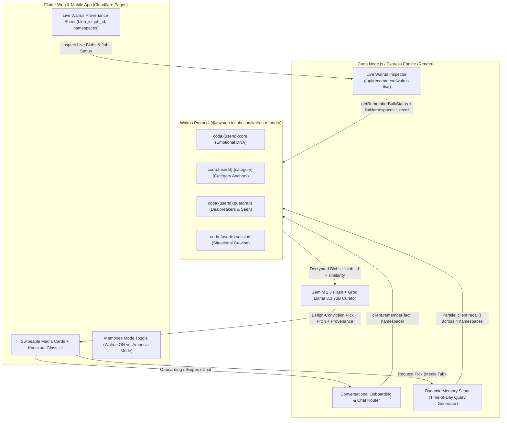

# 🦭 Coda — Personal Media Taste Curator

> **Built for the FBC × Walrus Memory Hackathon (Walrus Session 8: Chatbots That Remember)**  
> **Tracks**: Build a Chatbot with Walrus Memory • Beyond the Big Two (Google Gemini + Groq) • Project Documentation & Technical Findings

**Coda** is an intentional, conversational media taste curator for **Movies, Anime, TV Shows, Video Games, Books, Visual Novels, and Manga**. Instead of overwhelming you with endless algorithmic grids, Coda acts like a perceptive friend who deeply knows your sensibilities—delivering **one high-conviction pick at a time**, complete with an atmospheric soundtrack preview, trailer, and a personal pitch grounded in your decentralized **Walrus Protocol Memory**.

---

## 🎯 Why Memory Is the Product (Not an Add-On)

Standard LLM chatbots suffer from **cultural amnesia**:
- Ask for a movie recommendation and you get the same generic IMDb Top 20 blockbusters.
- Tell it you hate jump-scares or cynical endings today, and tomorrow it recommends *Hereditary*.
- Mark a film as watched, and three turns later it pitches you the exact same film again.

**Coda solves this by making Walrus Memory (`@mysten-incubation/walrus-memory`) its entire cognitive backbone:**
1. **Conversational Taste Profiling**: During onboarding and ongoing chats, Coda extracts your emotional triggers, pacing preferences, favorite touchstones, and hard boundaries—writing them as SEAL-encrypted, retrieval-optimized memory blobs onto Walrus.
2. **Dynamic Memory Scout**: Before curating a pick, Coda synthesizes a situational, time-of-day semantic query (e.g., *"What type of film to watch this Sunday afternoon based on favorite movie anchors and themes?"*) and queries your Walrus namespaces in parallel.
3. **Continuous Swipe & Chat Learning**: Every card swipe (**Loved It**, **Already Seen**, **Not For Me + Reason**), **Pitch Discussion**, **Ask Coda**, and **Post-Session Reflection** writes new taste anchors and guardrails back to Walrus.
4. **Live On-Chain Provenance UI**: Tapping any **🦭 Saved to Walrus Memory** or **🦭 Recalled from Walrus Memory** badge opens Coda's frosted-glass provenance inspector—pulling live data from Walrus to show your **Account Object ID**, **active namespaces**, **Dynamic Memory Scout query**, and copyable **Walrus `blob_id`s**.
5. **Interactive "Amnesia Mode" (`Memories OFF` Toggle)**: Toggle **Memories OFF** in the app menu to experience an instant Before/After comparison. With Walrus Memory disabled, Coda refreshes all tabs in brain-dead mode—making generic commercial picks, repeating titles you've already watched, and refusing to learn from swipes.

---

## 🏗️ Architecture & Multi-Namespace Walrus Routing

Instead of dumping raw chat logs into a single flat bucket, Coda decomposes user interactions into **self-contained, semantically enriched memory blobs** routed across four isolated per-user Walrus namespaces:

| Walrus Namespace | Purpose | Example Retrieval-Optimized Blob Stored on Walrus |
| :--- | :--- | :--- |
| `coda:<userId>:core` | **Aesthetic & Emotional DNA** | `[Core Taste & Emotional DNA] When choosing what to watch, read, or play, the user resonates with: melancholic sci-fi, quiet existential dread, and slow-burn atmospheric worldbuilding.` |
| `coda:<userId>:<category>` | **Category Taste Anchors** (`movie`, `anime`, `game`, etc.) | `[MOVIE Taste Anchor] Favorite movie benchmark: "Stalker (1979)" — meditative pacing, philosophical inquiry, haunting tactile atmosphere. Recommend movie works matching this tone and depth.` |
| `coda:<userId>:guardrails` | **Dealbreakers & Seen History** | `[Dealbreaker & Content Boundary] Avoid recommending works with: cheap jump scares or marvel-style quippy dialogue.` / `Already watched/seen: "Arrival" (do not recommend again)` |
| `coda:<userId>:session` | **Active Situational Craving** | `[Active Mood & Situational Craving (afternoon)] Right now in the afternoon, the user is craving: a cerebral mystery for a rainy Sunday afternoon.` |



---

## 🔄 Before vs. After: The "Memories OFF" (Amnesia Mode) Demo

Judges can test the exact impact of Walrus Memory live inside the app using the **Memories** toggle in the top-right menu:

| Dimension | 🦭 Walrus Memory **ON** (Default) | 🧠 Walrus Memory **OFF** (Amnesia Mode) |
| :--- | :--- | :--- |
| **Context Passed to LLM** | Parallel semantic recall from `core`, `<category>`, `guardrails`, and `session` Walrus namespaces | **Zero** user memory, **zero** taste anchors, **zero** exclusions |
| **Recommendation Quality** | Deeply personal, high-conviction picks tailored to your emotional DNA and time of day | Random commercial/mainstream picks that completely ignore your taste |
| **Seen & Rejected Filtering** | Strictly excludes all watched and rejected titles stored in `coda:<userId>:guardrails` | Forgets what you've seen—will actively recommend movies you already watched or skipped |
| **Swipe Feedback Loop** | Right-swipe (**Loved** / **Seen**) and Left-swipe (**Not For Me**) write new blobs to Walrus | Swipes are **not saved**; snackbar alerts: `🧠 Walrus Memory is OFF — taste memory was not saved` |
| **Provenance Inspector** | Displays live **Dynamic Memory Scout** query, active namespaces, and on-chain **Walrus `blob_id`s** | Provenance badges hidden because no Walrus memories were consulted |

---

## 🔍 Technical Findings & `@mysten-incubation/walrus-memory` Engineering Notes

While building Coda on `@mysten-incubation/walrus-memory` (`v0.2.0`), we identified and solved several real-world engineering challenges for interactive consumer apps:

1. **Bridging Async Walrus Batch Sealing (`job_id` → `blob_id`) with Read-Your-Own-Writes**:
   - **Finding**: `client.remember()` queues writes asynchronously in batches on the Walrus relayer (`status: "pending" / "uploading"`) and returns a `job_id` before the final Walrus `blob_id` is sealed on-chain. If a user finishes onboarding and immediately requests a recommendation 2 seconds later, `client.recall()` may not yet return the blob that is currently sealing.
   - **Solution**: We implemented a write-through provenance cache (`recentWritesByUser` in [`backend/services/walrusMemoryService.js`](backend/services/walrusMemoryService.js)) paired with `client.getRememberBulkStatus(jobIds)`. Coda immediately merges in-flight writes into `recallForRecommendation()` while polling `getRememberBulkStatus` in the background so the UI seamlessly transitions from `WALRUS BATCH JOB: <job_id> • SEALING BLOB` to `BLOB ID: <blob_id>` as soon as Walrus seals the blob.
2. **Retrieval-Optimized Semantic Blob Formatting**:
   - **Finding**: Storing bare titles (e.g., `"2001: A Space Odyssey"`) in Walrus produces weak vector similarity when querying with natural-language situational prompts like *"What type of film to watch this afternoon?"*.
   - **Solution**: Before calling `client.remember()`, Coda enriches short anchors with their thematic/emotional context (`[MOVIE Taste Anchor] Favorite movie benchmark: "2001: A Space Odyssey" — existential cosmic awe, deliberate pacing, visual symphony...`), dramatically improving semantic recall precision across namespaces.

---

## 🛠️ Tech Stack

- **Memory Layer**: **Walrus Protocol** (`@mysten-incubation/walrus-memory` SDK, SEAL encryption, Sui on-chain ownership)
  - **Walrus Account Object ID**: `0x48b30fecc266bef51e01ae32c4f610bbe2910ed09a4c022e27383999aa331d55`
  - **Relayer**: `https://relayer.memory.walrus.xyz`
- **LLMs ("Beyond the Big Two")**:
  - **Google Gemini** (`gemini-2.5-flash`) — Conversational taste extraction, Dynamic Memory Scout query synthesis, and high-conviction curation
  - **Groq** (`llama-3.3-70b-versatile`) — Ultra-low-latency pitch generation, vibe checks, and real-time voice transcription (`whisper-large-v3-turbo`)
- **Frontend**: **Flutter** (Web & Mobile), Riverpod state management, GoRouter, custom frosted-glass knockout shader UI
- **Backend**: **Node.js & Express**, TMDB / OMDb / iTunes / YouTube / AniList / Steam / Google Books multi-media asset resolution pipeline

---

## 🚀 Local Setup Instructions

### Prerequisites
- **Flutter SDK** (`>=3.11.0`)
- **Node.js** (`>=20.0.0`)
- A **Walrus Memory** private key & account object ID (`WALRUS_MEMORY_KEY`, `WALRUS_MEMORY_ACCOUNT_ID`)
- **Google Gemini API Key** (`GEMINI_API_KEY`) and **Groq API Key** (`GROQ_API_KEY`)

### 1. Clone & Configure Environment
```bash
git clone https://github.com/chief-07/coda-personal-media-taste-curator.git
cd coda-personal-media-taste-curator
cp assets/env.local.example assets/env.local
```
Fill in `assets/env.local` with your keys:
```env
GEMINI_API_KEY=your_gemini_api_key
GROQ_API_KEY=your_groq_api_key
WALRUS_MEMORY_KEY=your_walrus_private_key
WALRUS_MEMORY_ACCOUNT_ID=your_walrus_account_object_id
WALRUS_MEMORY_RELAYER_URL=https://relayer.memory.walrus.xyz
TMDB_API_KEY=your_tmdb_api_key
OMDB_API_KEY=your_omdb_api_key
```

### 2. Start the Backend Server
```bash
cd backend
npm install
node server.js
```
The backend starts on `http://localhost:8080` (and `https://localhost:8443` for LAN voice/mic testing).

### 3. Build & Run the Flutter Web App
```bash
flutter pub get
flutter build web --release --no-wasm-dry-run
```
Open `http://localhost:8080` in your browser.

---

## ☁️ Production Deployment (Render + Cloudflare Pages)

### Backend on Render
1. Connect your GitHub repository to **Render** as a **Web Service** (or use the included [`render.yaml`](render.yaml) Blueprint).
2. Set **Root Directory** to `backend`, **Build Command** to `npm install`, and **Start Command** to `node server.js`.
3. Add your environment variables (`GEMINI_API_KEY`, `GROQ_API_KEY`, `WALRUS_MEMORY_KEY`, `WALRUS_MEMORY_ACCOUNT_ID`, `WALRUS_MEMORY_RELAYER_URL`, `TMDB_API_KEY`, `OMDB_API_KEY`) in the Render Dashboard.
4. Copy your live Render URL (e.g., `https://coda-backend.onrender.com`).

### Frontend on Cloudflare Pages
1. Update `assets/env.txt` with `CODA_API_URL=https://your-render-backend.onrender.com` (or pass `--dart-define=CODA_API_URL=https://your-render-backend.onrender.com` during build).
2. Build the web bundle locally (`flutter build web --release --no-wasm-dry-run`) and deploy `build/web` directly via Wrangler:
   ```bash
   npx wrangler pages deploy build/web --project-name coda-taste-curator
   ```
   Or connect the GitHub repository to **Cloudflare Pages** with build output directory `build/web`.
