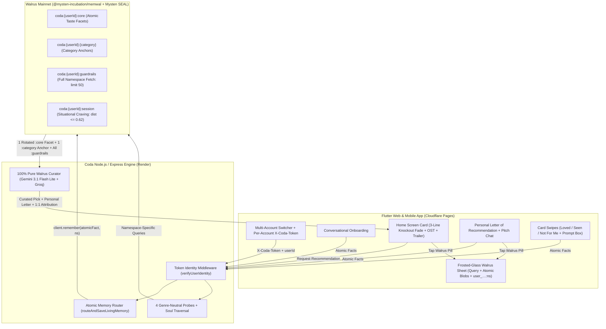

# 🦭 Coda — A Personal Media Curator That Remembers Your Taste Using Walrus Memory

> **Built for the Walrus Memory Hackathon (Walrus Session 8: Chatbots That Remember)**  
> **Tracks**: Best Chatbot • Beyond the Big Two (Google Gemini + Groq) • Best Article • Bug Bounty  
> 🌐 **Live Web & PWA App (Cloudflare Pages)**: **[https://coda-88k.pages.dev](https://coda-88k.pages.dev)**  
> ⚡ **Live Curation & Walrus Engine (Render)**: **[https://coda-personal-media-taste-curator.onrender.com](https://coda-personal-media-taste-curator.onrender.com)**  
> 🔗 **Walrus Mainnet Account Object**: **[`0x48b30fecc266bef51e01ae32c4f610bbe2910ed09a4c022e27383999aa331d55`](https://suiscan.xyz/mainnet/object/0x48b30fecc266bef51e01ae32c4f610bbe2910ed09a4c022e27383999aa331d55)** (**551+ Mainnet Blobs** across **95 Namespaces** & **17+ Multi-User Profiles**)

**Coda is a personal media curator that remembers your taste using Walrus Memory.** Built for **Movies, Anime, TV Shows, Video Games, Books, Visual Novels, and Manga**, Coda replaces noisy streaming grids and generic AI bullet lists with a perceptive friend who remembers who you are across sessions—delivering **one high-conviction pick at a time**, complete with its atmospheric soundtrack playing softly in the background, a preview trailer, and a personal letter of recommendation grounded **100% in your Walrus Protocol Memory**.

---

## 1. What Coda Does & Why Memory Matters

Choosing what art to let into your head isn't a utility task—it's an emotional ritual. Yet discovering what to watch, play, or read today is broken in two ways:
- **Streaming & Storefront Paralysis**: You open Netflix, Steam, or Crunchyroll on a tired evening, scroll past 400 thumbnails for 45 minutes, feel nothing, and close the app.
- **Amnesiac AI Chatbots**: You ask a standard chatbot for a recommendation, and it spits out a generic Wikipedia list of the same 10 blockbusters it gives to everyone else. The moment you close the tab, it forgets that you love kinetic action choreography *and* warm romantic comedies as distinct moods, that you hate torture-horror, or that you've already seen *John Wick* three times.

### How Coda Changes the Experience
1. **One Intentional Pick at a Time**: No infinite grids. Coda presents a single, full-bleed glassmorphic card chosen specifically for *you*.
2. **Sensory Immersion Before You Commit**: As soon as a card appears, its **original soundtrack (OST)** swells gently in the background so you can feel its atmosphere immediately, paired with an inline **trailer preview**.
3. **A Personal Letter, Not a Synopsis**: Instead of a generic plot summary, Coda writes a two-paragraph personal letter connecting the work's pacing, humor, action, or emotional texture directly to the specific atomic memories recalled from your Walrus namespaces.
4. **Cross-Session Memory That Grows With Every Action**: Every onboarding conversation, every chat message, every card swipe (**Loved It**, **Already Seen**, **Not For Me**), and every note typed into Coda's feedback prompt box is written as an atomic fact to **Walrus Mainnet** and recalled across future sessions.

---

## 2. How Walrus Memory Is Used Across Every Surface of Coda

Coda is not a media app with a memory feature bolted on—**Walrus Memory (`@mysten-incubation/memwal`) is the entire cognitive foundation of the app.** Across **every memory-aware LLM endpoint** (`/api/recommend`, `/api/recommend/chat`, `/api/recommend/ask`, `/api/recommend/feedback`, `/api/onboarding/harmonize`, `/api/onboarding/harmonize_all`, and `/api/recommend/swipe`), Gemini and Groq receive **zero local cognitive memory from the client**: 100% of your taste facets, favorite benchmarks, dealbreakers, and watched/rejected history are recalled live from Walrus Mainnet (with non-cognitive product state such as your saved `watchlist` when `watchlistOnly` is enabled as the sole exception). The Flutter client's local `LivingMemory` acts strictly as a UI state cache. Without Walrus Memory, Coda is completely blind.

### A. Conversational Onboarding (`POST /api/chat` & `POST /api/onboarding/profile`)
- Instead of a sterile genre checklist, Coda conducts a natural voice/text conversation across 4 milestones (emotional headspace, anchor titles & creators, guardrails & boundaries, and situational habits).
- On every turn, Coda extracts **self-contained, atomic memory facts**—never gluing unrelated tastes (like *"Loves kinetic action"* and *"Loves romantic comedies"*) into one muddy string—and seals them as individual blobs across `coda:<userId>:core`, `coda:<userId>:<category>`, and `coda:<userId>:guardrails`.
- Tapping **Remembered on Walrus** under any Coda response opens a frosted-glass Walrus provenance sheet showing the truncated user namespace (`user_…7d6c:core`) and live `blob_id` / `job_id`.

### B. The Recommendation Engine (`POST /api/recommend`)
When curating a recommendation for any media tab, Coda runs a multi-stage Walrus retrieval pipeline (`curateWithWalrusMemory` in [`backend/services/walrusMemoryService.js`](backend/services/walrusMemoryService.js)):
1. **4 Genre-Neutral Dynamic Probes**: Rather than biasing toward a single mood, Coda rotates across 4 genre-neutral probes so comedy, kinetic action, romance, sci-fi, and drama all surface naturally:
   - *Probe 1 (General Taste & Genres)*: `"What types of <media> and genres is the user interested in to <watch/read/play>?"`
   - *Probe 2 (Favorite Titles & Creators)*: `"Which favorite <media> titles, directors, studios, or creators does the user love?"`
   - *Probe 3 (Tone, Humor, Action & Style)*: `"What tone, humor, action, pacing, or storytelling style does the user enjoy in <media>?"`
   - *Probe 4 (Situational / Time-of-Day Habit)*: `"What kind of <media> does the user like to <watch/read/play> in the <morning/afternoon/evening/late night>?"`
2. **Namespace-Specific Querying**:
   - `coda:<userId>:core` is queried for core taste facets and genres.
   - `coda:<userId>:<category>` is queried specifically for favorite benchmark titles and creators in that medium.
   - `coda:<userId>:session` is queried for active right-now cravings or time-of-day watch habits—and time-of-day is **only** applied if a strong semantic match (`distance <= 0.62`) exists, preventing ambient clock noise from overriding permanent preferences.
   - `coda:<userId>:guardrails` is fetched **in full** (`sort: 'recent', limit: 50`, no distance cutoff) so every dealbreaker, content boundary, already-watched title, and rejected work is strictly enforced on every pick.
3. **Soul Traversal (Spotlighting Distinct Atomic Facets)**:
   - Instead of dumping every recalled memory blob into the LLM at once (which causes the model to average all your genres into repetitive picks), Coda **traverses your soul** across recommendations—spotlighting **1 rotated atomic facet from `:core` + 1 matching anchor from `:<category>`** per card. One card explores your love for kinetic action (*John Wick*), while the next explores your love for warm romantic comedy (*About Time*).

### C. The Personal Letter of Recommendation (`POST /api/recommend/pitch`)
- Tapping any recommendation card opens Coda's **Personal Letter of Recommendation**—two vivid paragraphs explaining *why* this specific title was chosen for you, citing the exact spotlighted atomic memories recalled from Walrus and displaying the **Recalled from Walrus** provenance sheet (`user_…7d6c:movie · blob …`).

### D. All Three Conversational Chat Surfaces (Bidirectional Recall + Live Memory Extraction)
Every chat surface in Coda both **recalls** relevant Walrus memories to ground its replies and **extracts & stores** new atomic memories when you reveal a preference or boundary:
- **Pitch Screen Chat (`POST /api/recommend/chat`)**: Ask Coda whether a recommended work's pacing, tone, or content fits you. Coda recalls your Walrus profile (`:core`, `:<category>`, `:guardrails`, `:session`) with zero local memory injected to answer honestly and seals any new preferences you mention during the discussion.
- **Ask Coda (`POST /api/recommend/ask`)**: Tell Coda what you're craving right now (*"Give me a tight 90-minute thriller"* or *"I never watch slow-burn dramas on weeknights"*). Coda recalls your Walrus soul + guardrails to curate on the spot and routes durable preferences to `:core` / `:guardrails` and active cravings to `:session`.
- **Post-Session Reflection Chat (`POST /api/onboarding/harmonize`)**: After completing a work (`Start Session → Complete`), Coda recalls your Walrus memories, debriefs with you on what landed emotionally, and seals your post-experience takeaways directly into Walrus.

### E. Card Swipes & Custom Feedback Prompt Box (`POST /api/recommend/swipe` & `/feedback`)
Every physical action on a card directly updates your Walrus namespaces:
- **Swipe Right Deep → "Loved It"**: Writes a positive taste anchor to `coda:<userId>:<category>`, a core affinity facet to `coda:<userId>:core`, and logs `Already watched/seen: "<Title>"` in `coda:<userId>:guardrails`.
- **Swipe Right Moderate → "Already Seen"**: Writes `Already watched/seen: "<Title>"` to `coda:<userId>:guardrails` so Coda never recommends it again.
- **Swipe Left → "Not For Me" + Custom Feedback Prompt Box**: Writes a rejection guardrail to `coda:<userId>:guardrails`, or lets you **type any specific reason into the custom prompt box** (e.g., *"Too much shaky-cam"* or *"No bleak endings"*), sealing that boundary to `coda:<userId>:guardrails` so future recommendations respect it immediately.

---

## 3. Multi-User Memory Model & Namespace-Partitioned Architecture

Each Coda account gets its own logically isolated Walrus Memory namespace set under Coda's shared Sui Mainnet `MemWalAccount` (`0x48b30fec...`), protected by **per-account token authentication (`X-Coda-Token`)**:

1. **Per-Account Token Identity Boundary ([`backend/middleware/userAuth.js`](backend/middleware/userAuth.js) & [`user_id_provider.dart`](lib/src/core/providers/user_id_provider.dart))**:
   - The backend does **not** blindly trust raw `userId` strings from the client.
   - When an account (`user_<timestamp>_<hex>`) is created in Coda, the client generates a 128-bit per-account token (`tok_<32-hex>`) persisted per account snapshot (`acct_<userId>_coda_user_token`) and sends it via the `X-Coda-Token` HTTP header on all API requests.
   - On the backend, `verifyUserIdentity` validates the `userId` format (`/^[a-zA-Z0-9_-]{3,80}$/`), binds `userId → HMAC-SHA256(token)` on first use, and rejects any unauthenticated or mismatched-token attempt to read or mutate another user's `userId` (`401/403`).
2. **Logical Namespace Partitioning on Walrus**:
   - Each Coda account gets its own logically isolated Walrus Memory namespace set (`coda:<userId>:core`, `coda:<userId>:<category>`, `coda:<userId>:guardrails`, `coda:<userId>:session`) under Coda's Mainnet `MemWalAccount`:

| Partitioned Walrus Namespace | Cognitive Role & Query Strategy | Example Atomic Blob Stored on Walrus |
| :--- | :--- | :--- |
| `coda:<userId>:core` | **Atomic Taste Facets & Genres** — Queried via the 4 Genre-Neutral Probes; 1 rotated facet spotlighted per pick | `Loves high-octane kinetic action thrillers with practical stunts` |
| `coda:<userId>:<category>` | **Category Taste Anchors** (`movie`, `anime`, `game`, `book`, `tv`, `manga`, `visualnovel`) — 1 matching anchor spotlighted per pick | `Favorite movie: John Wick (relentless choreography and worldbuilding)` |
| `coda:<userId>:guardrails` | **Dealbreakers, Seen & Rejected History** — Fetched **in full** (`sort: 'recent', limit: 50`) on every recommendation as hard negative constraints | `Dealbreaker: No torture horror or extreme gore` / `Already watched/seen: "John Wick"` |
| `coda:<userId>:session` | **Active Situational Craving** — Written when an explicit right-now mood or time-of-day habit is stated; applied when `distance <= 0.62` | `Right now (late night): Soothing, quiet atmospheric film before bed` |

---

## 4. Before / After Demo: What Changes With Walrus Memory

### Cross-Session Memory Flow (Judge Verification Path)
```text
Tell Coda your taste during onboarding ("I love kinetic action like John Wick and warm rom-coms like About Time, but no torture horror")
        ↓
Coda decomposes and seals atomic facts into coda:<userId>:core, :movie, and :guardrails on Walrus Mainnet
        ↓
Close tab / restart browser / switch accounts and return
        ↓
Ask for a Movie recommendation (zero local memory sent to Gemini)
        ↓
Coda recalls your Walrus Mainnet blobs via Soul Traversal & full :guardrails
        ↓
Recommendation + Personal Letter explicitly reflect your recalled Walrus blobs (and never repeat seen/rejected titles)
```

### Live In-App Comparison: Walrus Memory **ON** vs. **OFF** (Amnesia Mode)
Judges can toggle **Memories** ON and OFF live in **Library → Settings** to compare Coda's behavior with and without Walrus Memory:

| Dimension | 🦭 Walrus Memory **ON** (Default) | 🧠 Walrus Memory **OFF** (Amnesia Mode) |
| :--- | :--- | :--- |
| **Memory Input to Curator** | **100% Pure Walrus Memory**: Spotlighted atomic facets from `:core` & `:<category>`, active `:session`, and full `:guardrails` | **Zero** user memory (`userId: null`), **zero** taste anchors, **zero** guardrails |
| **Recommendation Quality** | High-conviction picks traversing distinct facets of your soul (action, comedy, romance, sci-fi, etc.) | Generic commercial/mainstream picks with no personal connection |
| **Seen & Rejected Filtering** | Strictly excludes all watched and rejected titles recalled from `coda:<userId>:guardrails` | Forgets what you've seen—will recommend titles you already watched or rejected |
| **Swipe & Prompt Box Learning** | **Loved**, **Seen**, and **Not For Me + Prompt Box** write new atomic blobs to Walrus Mainnet | Swipes are **not written** to Walrus; snackbar alerts: `🧠 Walrus Memory is OFF — taste memory was not saved` |
| **Walrus Provenance Sheet** | Displays the exact **Query** and **Spotlighted Atomic Memories** (`user_…7d6c:core · blob …`) that drove the pick | Hidden because no Walrus memories were consulted |

---

## 5. Architecture



---

## 6. Walrus Mainnet Proof

All Coda memories are sealed and stored on **Walrus Mainnet** via the official Mysten MemWal production relayer:

- **Network**: **Mainnet** (`https://relayer.memory.walrus.xyz/config` → `network: "mainnet"`, `suiGrpcUrl: "https://mysten-rpc.mainnet.sui.io"`)
- **Walrus Memory Account / Agent ID**: [`0x48b30fecc266bef51e01ae32c4f610bbe2910ed09a4c022e27383999aa331d55`](https://suiscan.xyz/mainnet/object/0x48b30fecc266bef51e01ae32c4f610bbe2910ed09a4c022e27383999aa331d55)
- **MemWal Mainnet Move Package ID**: [`0xe7c16fbea0560e7057e2bf7422feaa4fb313749fc69c9e9092fac7a33b81d7f5`](https://suiscan.xyz/mainnet/object/0xe7c16fbea0560e7057e2bf7422feaa4fb313749fc69c9e9092fac7a33b81d7f5)
- **Total Mainnet Blobs Sealed**: **551+ atomic memory blobs** across **95 namespaces**
- **Multi-User Proof**: **17 distinct user accounts** with $\ge 10$ Mainnet memories each (exceeding the DeepSurge requirement of $\ge 3$ users with $\ge 10$ memories each):

| User Account (`userId`) | Mainnet Blobs | Partitioned Namespaces on Walrus Mainnet |
| :--- | :---: | :--- |
| `user_1791224353234_85d1b31f` | **77 blobs** | `:core` (15), `:movie` (11), `:anime` (1), `:book` (1), `:guardrails` (42), `:session` (7) |
| `user_1791191900201_dc0849e2` | **29 blobs** | `:core` (14), `:movie` (2), `:guardrails` (8), `:session` (5) |
| `user_1791211448320_a8b57632` | **26 blobs** | `:core` (8), `:movie` (1), `:guardrails` (12), `:session` (5) |
| `user_1791219795117_8b188789` | **22 blobs** | `:core` (9), `:guardrails` (8), `:session` (5) |
| `user_1791109616812_a2a05be2` | **19 blobs** | `:core` (3), `:movie` (5), `:guardrails` (7), `:session` (4) |
| `user_1791212154389_f3400e13` | **16 blobs** | `:core` (6), `:music` (3), `:guardrails` (3), `:session` (4) |

---

## 7. Tech Stack & "Beyond the Big Two" LLM Runtime Disclosure

Coda uses **zero OpenAI or Anthropic models**. All reasoning, atomic memory decomposition, curation, and voice transcription run on alternative model providers (**Google Gemini + Groq**):

- **Memory Layer**: **Walrus Protocol** (`@mysten-incubation/memwal` `v0.1.8`, Mysten SEAL `@mysten/seal` encryption, Sui Mainnet on-chain ownership)
- **Primary LLM — Google Gemini (`gemini-3.1-flash-lite`)**:
  - Powers conversational onboarding, atomic fact decomposition, 4-probe Soul Traversal curation, and personal letters of recommendation via `backend/services/geminiClient.js`.
- **Fallback LLM & Voice Runtime — Groq (`qwen/qwen3.8-27b` & `whisper-large-v3`)**:
  - Provides automatic rate-limit failover (`429`/`503`) in `geminiClient.js` and ultra-low-latency voice-to-text transcription in `backend/routes/chat.js`.
- **Runtime Integration Friction with Walrus Memory**:
  1. *Sub-second inference vs. async Walrus batch sealing*: `gemini-3.1-flash-lite` and Groq `qwen/qwen3.8-27b` respond in $<800\text{ms}$, whereas Walrus `remember()` queues an async `202 Accepted` batch upload + Sui PTB that takes 5–25s to seal. Without a write-through cache, next-turn LLM calls cannot see memories written on the previous turn.
  2. *Multi-genre context blending*: Passing all recalled Walrus blobs into smaller/faster non-frontier models causes them to blend every genre together into safe mainstream picks. Our **Soul Traversal** architecture (spotlighting 1 rotated `:core` facet + 1 `:<category>` anchor while keeping full `:guardrails`) solved this completely.
- **Frontend**: **Flutter** (Web & Mobile PWA), Riverpod state management, GoRouter, custom frosted-glass UI (`docs/architecture.md`)
- **Backend**: **Node.js & Express**, TMDB / OMDb / iTunes / YouTube / AniList / Steam / Google Books metadata & OST/trailer resolution pipeline

---

## 8. Technical Findings & MemWal SDK Bug Reports (`@mysten-incubation/memwal` v0.1.8)

While building and stress-testing Coda against `@mysten-incubation/memwal` (`v0.1.8`) and `https://relayer.memory.walrus.xyz`, we uncovered **four concrete SDK/relayer bugs and friction points**, along with the workarounds implemented in Coda:

### Bug #1: `getRememberBulkStatus()` / `getRememberStatus()` Unnecessarily Trigger Full Sui RPC + SEAL `SessionKey` Generation on Metadata-Only Calls
- **Location**: `@mysten-incubation/memwal/dist/memwal.js` — `getRememberStatus` (line 332), `getRememberBulkStatus` (line 467), and `signedRequest` (lines 1257–1300).
- **Expected vs. Actual**: Polling job status (`GET /api/remember/status/:id` or `POST /api/remember/bulk/status`) never decrypts SEAL ciphertext—it only checks relational job status (`pending` / `uploading` / `done`) and `blob_id`. While `listNamespaces()` (line 761) and `health()` properly pass `{ includeDelegateKey: false }`, both `getRememberStatus(jobId)` and `getRememberBulkStatus(jobIds)` **omit** `{ includeDelegateKey: false }`, forcing a cold client to import `@mysten/seal` + `@mysten/sui`, fetch `/config`, connect to the Sui RPC node, and sign a SEAL `SessionKey` personal message (adding 1–3s latency).
- **Recommended SDK Fix**: Pass `{ includeDelegateKey: false }` in `getRememberStatus` and `getRememberBulkStatus`.

### Bug #2: Schema Asymmetry & Missing `namespace` Field in `getRememberBulkStatus()` vs `getRememberStatus()`
- **Location**: `@mysten-incubation/memwal/dist/memwal.js` — `getRememberStatus` (lines 331–342) vs. `getRememberBulkStatus` (lines 466–515).
- **Expected vs. Actual**: Single status lookup (`getRememberStatus`) returns `{ job_id, status, blob_id, namespace, error }`. Bulk status lookup (`POST /api/remember/bulk/status`) returns `{ results: [...] }` where items **omit `namespace`** unless the caller manually tracks and re-injects an external `namespaces` map.
- **Coda Workaround**: In [`backend/services/walrusMemoryService.js`](backend/services/walrusMemoryService.js) (`resolvePendingWriteJobs`), we maintain `recentWritesByUser` keyed by `job_id` to preserve the original `namespace` and merge `bulkRes.results` (`blob_id`, `status`) back into the namespace-tagged record.

### Bug #3: 30-Minute Deterministic Idempotency Key Collision (`derivedIdempotencyKey`) Prevents Legitimate Re-Saves After Reset/Restore
- **Location**: `@mysten-incubation/memwal/dist/memwal.js` — `IDEMPOTENCY_BUCKET_MS` and `derivedIdempotencyKey` (lines 64–68, 307).
- **Expected vs. Actual**: When `remember(text, namespace)` is called without an explicit `idempotencyKey`, the SDK hashes `Math.floor(Date.now() / (30 * 60 * 1000))` with `namespace` and `text`. Because `remember_jobs` rows are not pruned on reset, re-submitting an identical `(namespace, text)` pair within the same 30-minute window returns the old cached job instead of enqueueing a fresh write.

### Bug #4: Async Walrus Batch Sealing (`202 Accepted` Delay) Breaks Immediate Read-Your-Own-Writes in Conversational Agents
- **Location**: `@mysten-incubation/memwal` `remember()` (async `202 Accepted` queue) → `recall()` pipeline.
- **Expected vs. Actual**: Sealing a memory onto Walrus Mainnet + executing the Sui PTB (`2N + K` Move calls) takes 5–25 seconds asynchronously. When a user finishes onboarding or swipes a card on Turn $T$ and immediately requests a recommendation on Turn $T+1$ (1–2 seconds later), `client.recall()` returns **zero results** for the just-saved memory because the Walrus blob is still in `status: "uploading"`.
- **Coda Workaround**: We built a write-through provenance cache (`recentWritesByUser` + `resolvePendingWriteJobs` in [`backend/services/walrusMemoryService.js`](backend/services/walrusMemoryService.js)) that merges in-flight atomic writes into `recallForRecommendation()` while polling `getRememberBulkStatus` in the background—upgrading `sealing <job_id>` to `blob <blob_id>` the instant Walrus seals the blob.

---

## 9. Setup Instructions

### Prerequisites
- **Flutter SDK** (`>=3.29.0` / Dart SDK `^3.11.4`)
- **Node.js** (`>=20.0.0`)
- **Walrus Memory Mainnet Credentials** (`MEMWAL_PRIVATE_KEY`, `MEMWAL_ACCOUNT_ID`)
- **Google Gemini API Key** (`GEMINI_API_KEY`) and **Groq API Key** (`GROQ_API_KEY`)

### 1. Clone & Configure Environment
```bash
git clone https://github.com/chief-07/Coda-Personal-Media-Taste-Curator.git
cd Coda-Personal-Media-Taste-Curator
cp assets/env.local.example assets/env.local
```
Fill in `assets/env.local` (or `backend/.env`) with your environment variables:
```env
GEMINI_API_KEY=your_gemini_api_key
GROQ_API_KEY=your_groq_api_key
MEMWAL_PRIVATE_KEY=your_walrus_delegate_private_key
MEMWAL_ACCOUNT_ID=your_walrus_account_object_id
MEMWAL_SERVER_URL=https://relayer.memory.walrus.xyz
TMDB_API_KEY=your_tmdb_api_key
OMDB_API_KEY=your_omdb_api_key
```

### 2. Start the Backend Server
```bash
cd backend
npm install
node server.js
```
The backend listens on `http://localhost:8080` (and `https://localhost:8443` for LAN microphone testing).

### 3. Build & Run the Flutter Web App
```bash
flutter pub get
flutter build web --release --no-wasm-dry-run --dart-define=CODA_API_URL=http://localhost:8080
```
Open `http://localhost:8080` in your browser.
