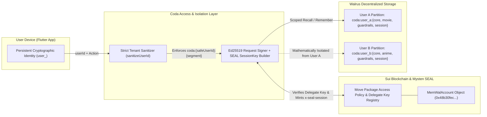
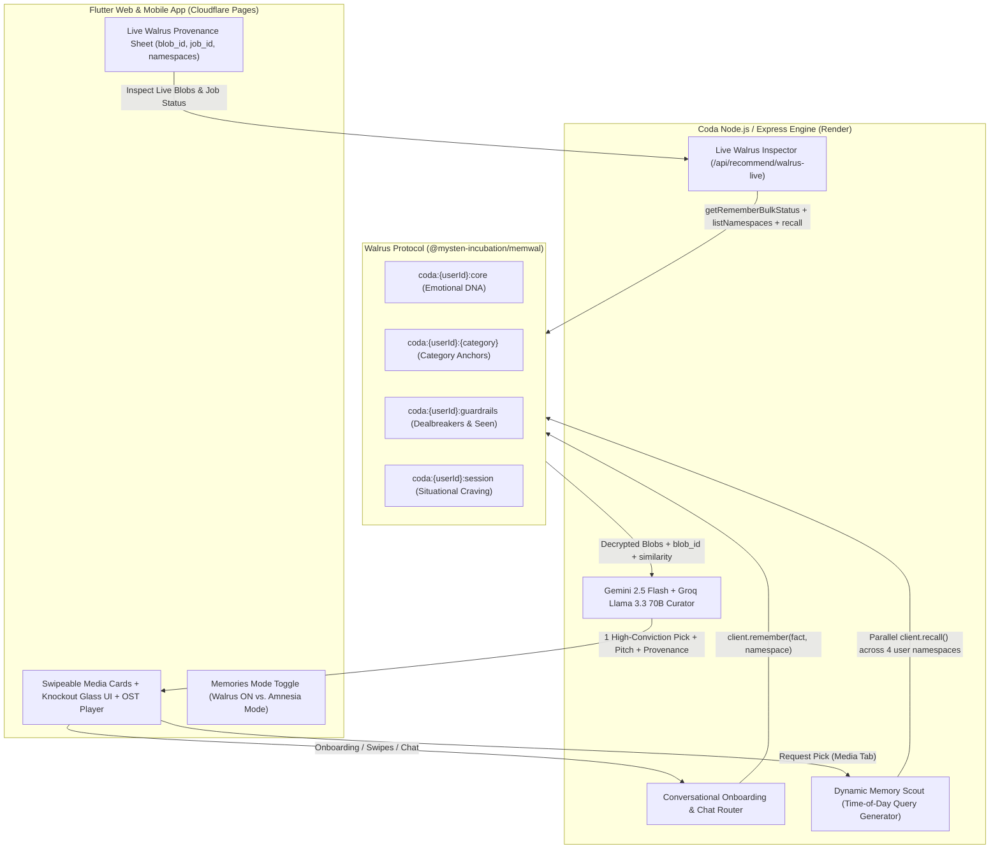

# 🦭 Coda — Personal Media Taste Curator

> **Built for the Walrus Memory Hackathon (Walrus Session 8: Chatbots That Remember)**  
> **Tracks**: Build a Chatbot with Walrus Memory • Beyond the Big Two (Google Gemini + Groq) • Project Documentation & Technical Bug Findings

**Coda** is an intentional, conversational media taste curator for **Movies, Anime, TV Shows, Video Games, Books, Visual Novels, and Manga**. Instead of burying you under soulless algorithmic grids, Coda acts like that one deeply perceptive friend who actually remembers who you are—delivering **one high-conviction pick at a time**, complete with its atmospheric soundtrack playing softly in the background, a preview trailer, and an intimate pitch grounded in your decentralized **Walrus Protocol Memory**.

---

## ✨ The Philosophy: Why Choosing What to Experience Should Feel Like an Experience

Think about the stories that have shaped your life—the film you watched at 2 AM that left you staring at the ceiling as the credits rolled, the anime whose soundtrack still gives you goosebumps years later, the novel or game that carried you through a quiet season of your life.

**Choosing what art to let into your head isn't a utility task. It's an emotional ritual.**

Yet today, discovering what to watch, play, or read feels completely broken:
- **Streaming & Storefront Paralysis**: You open Netflix, Steam, or Crunchyroll on a tired evening, scroll past 400 noisy thumbnails for 45 minutes, feel nothing, and close the app.
- **Soulless AI Lists**: You ask a standard chatbot for a recommendation, and it spits out a sterile, bulleted Wikipedia list of the same 10 mainstream blockbusters it gives to everyone else on earth. It doesn't know what broke your heart last month. It doesn't remember that you hate cynical endings, or that you've already seen *Arrival* three times.

### Coda Makes the Discovery Itself an Experience
We built Coda on a simple belief: **the moment you discover your next favorite story should feel almost as magical as experiencing the story itself.**

1. **One Intentional Pick at a Time**: No infinite grids. No paradox of choice. Coda presents a single, full-bleed glassmorphic artwork card chosen specifically for *you* in *this* moment.
2. **Sensory Immersion Before You Commit**: As soon as a card appears, its **original soundtrack (OST)** swells gently in the background so you can *feel* its atmosphere immediately, with a one-tap **trailer preview** right on the card.
3. **A Personal Letter, Not a Synopsis**: Instead of a generic plot summary, Coda writes a two-paragraph personal pitch connecting the work's pacing, themes, and emotional texture directly to the memories you've shared—and highlights the exact **Walrus Memory** that inspired the pick.
4. **A Curator That Grows With You**: Whether you talk to Coda by voice or text, swipe right because you loved a film, or swipe left and tell Coda *"Too bleak for tonight,"* that nuance is permanently woven into your living taste graph on Walrus.

---

## 🎯 Why Memory Is the Product (Not an Add-On)

Standard LLM chatbots suffer from **cultural amnesia**:
- Ask for a movie recommendation and you get the same generic IMDb Top 20 blockbusters.
- Tell it you hate jump-scares or Marvel-style quippy dialogue today, and tomorrow it recommends *Guardians of the Galaxy*.
- Mark a film as watched, and three turns later it pitches you the exact same film again.

**Coda solves this by making Walrus Memory (`@mysten-incubation/memwal`) its entire cognitive backbone:**
1. **Conversational Taste Profiling**: During onboarding and ongoing chats, Coda extracts your emotional triggers, pacing preferences, favorite touchstones, and hard boundaries—writing them as SEAL-encrypted, retrieval-optimized memory blobs onto Walrus.
2. **Dynamic Memory Scout**: Before curating a pick, Coda synthesizes a situational, time-of-day semantic query (e.g., *"What type of film to watch this Sunday afternoon based on favorite movie anchors and themes?"*) and queries your partitioned Walrus namespaces in parallel.
3. **Continuous Swipe & Chat Learning**: Every card swipe (**Loved It**, **Already Seen**, **Not For Me + Reason**), **Pitch Discussion**, **Ask Coda**, and **Post-Session Reflection** writes new taste anchors and guardrails back to Walrus.
4. **Live On-Chain Provenance UI**: Tapping any **🦭 Saved to Walrus Memory** or **🦭 Recalled from Walrus Memory** badge opens Coda's frosted-glass provenance inspector—pulling live data from Walrus to show your **Account Object ID**, **active user namespaces**, **Dynamic Memory Scout query**, and copyable **Walrus `blob_id`s**.
5. **Interactive "Amnesia Mode" (`Memories OFF` Toggle)**: Toggle **Memories OFF** in the app menu to experience an instant Before/After comparison. With Walrus Memory disabled, Coda refreshes all tabs in brain-dead mode—making generic commercial picks, repeating titles you've already watched, and refusing to learn from swipes.

---

## 🦭 Why *Only* Walrus Memory Suited Coda (vs. Legacy DBs & Alternative Memory Systems)

When designing Coda, we evaluated traditional vector databases (**Pinecone, Qdrant, Supabase pgvector**) and centralized AI memory wrappers (**Mem0, Zep**). None of them could support what Coda needed. **Walrus Memory (`@mysten-incubation/memwal`) was the only architecture that fit**, for four foundational reasons:

| Capability | Legacy Vector DBs (Pinecone / pgvector) | Centralized AI Memory SaaS (Mem0 / Zep) | 🦭 **Walrus Memory (`@mysten-incubation/memwal`)** |
| :--- | :--- | :--- | :--- |
| **Intimate Psychological Privacy** | Plaintext text & vectors stored on cloud servers; readable by DB admins & vulnerable to leaks | Plaintext memories processed and stored in vendor-controlled multi-tenant clouds | **End-to-End Mysten SEAL Encryption (`@mysten/seal`)**: Memories are encrypted into SEAL blobs governed by Sui Move policies before hitting decentralized Walrus storage |
| **Verifiable Memory Provenance** | Opaque internal UUIDs; users have zero proof whether an AI actually used their memory or hallucinated | Proprietary API logs; no cryptographic proof of storage or retrieval | **Content-Addressed `blob_id`s**: Every memory returns an immutable on-chain Walrus `blob_id` & `job_id` that users can inspect live in Coda's UI |
| **User-Owned Cultural Identity** | Locked inside a single app's private database; dies if the app shuts down | Vendor lock-in behind proprietary SaaS API keys | **Sui On-Chain Ownership (`MemWalAccount`)**: Taste namespaces live under a Sui on-chain account object (`0x48b30fec...`) portable across any Walrus-compatible agent |
| **Zero-Raw-Key Request Auth** | Static API keys shared across backend workers | Static bearer tokens | **Ed25519 Signatures + Scoped `x-seal-session` Keys**: Every write/recall is cryptographically signed (`x-signature`, `x-delegate-key`) without ever transmitting raw private keys |

### 1. Your Media Taste Is Intimate Psychological Data (Why SEAL Encryption Matters)
What art moves you—your quiet existential fears, the comfort shows you watch when you're overwhelmed, the themes you can't stomach—is a psychological fingerprint. In a legacy database or centralized memory SaaS, that profile sits in plaintext waiting to be scraped, sold to ad networks, or breached. With **Walrus Memory**, every memory blob is encrypted via **Mysten SEAL** (`SessionKey` scoped to the on-chain Move package) so that public decentralized storage nodes only ever hold ciphertext.

### 2. Proof Over Promises (`blob_id` Provenance vs. Black-Box Claims)
Every AI app *claims* to personalize recommendations. Coda **proves** it on every single card. Because Walrus returns verifiable `job_id`s and content-addressed `blob_id`s (e.g., `E9wD19xc2mWs3hD0vqcB8u4W1H0P8H94B8p4B4m6fG0`), Coda's frosted-glass Provenance Inspector lets users see the exact Walrus blobs recalled, the cosine similarity distance (`1 - distance`), and the exact namespace each memory came from.

### 3. Portable, Sovereign Taste That Outlives Any Single Algorithm
When you spend five years training Netflix or Spotify, you don't own that taste profile—they do. By anchoring memory to **Walrus + Sui**, a user's `coda:<userId>:*` namespaces represent a portable cultural identity that belongs to the user, not a streaming monopoly.

---

## 🔐 Multi-User Partitioned Namespaces & Access Control Architecture

Coda is built from the ground up as a **multi-user, multi-tenant system** where every user's taste graph is strictly partitioned, both across users and across cognitive memory types.

### How User Isolation & Access Control Work in Coda



1. **Cryptographic On-Chain Access Control (`MemWalAccount` + SEAL `SessionKey`)**:
   - At the protocol layer, access to Coda's Walrus memory store is governed by the on-chain Sui `MemWalAccount` object (`0x48b30fecc266bef51e01ae32c4f610bbe2910ed09a4c022e27383999aa331d55`).
   - Every request to the Walrus relayer is cryptographically signed using an **Ed25519 Delegate Key** (`x-delegate-key`, `x-signature`, `x-timestamp`) registered in `MemWalAccount.delegate_keys`, alongside a short-lived **SEAL `SessionKey`** (`x-seal-session`) signed against the Sui Move package. Unauthorized third parties cannot read, decrypt, or write blobs even if they know a `blob_id`.
2. **Per-User Multi-Namespace Partitioning (`coda:<userId>:<segment>`)**:
   - Why didn't we force every consumer to install a Sui wallet and buy SUI/WAL gas just to get a movie recommendation? Because Web3 wallet popups during onboarding destroy consumer UX.
   - Instead, Coda combines **account-level SEAL encryption** with **strict per-user namespace partitioning**. Each user device generates a persistent UUIDv4 (`user_<uuid>`), and Coda's backend enforces a strict namespace sanitizer (`sanitizeUserId` in [`backend/services/walrusMemoryService.js`](backend/services/walrusMemoryService.js)) that strips colons, wildcards, and control characters so no request can ever traverse outside its `coda:<userId>:<segment>` partition.
3. **Four Cognitive Sub-Namespaces Per User**:
   Instead of dumping raw chat logs into one noisy per-user bucket, Coda partitions *each user's* memory into four specialized Walrus namespaces queried concurrently via `Promise.all`:

| Partitioned Walrus Namespace | Cognitive Role | Example Retrieval-Optimized Blob Stored on Walrus |
| :--- | :--- | :--- |
| `coda:<userId>:core` | **Aesthetic & Emotional DNA** | `[Core Taste & Emotional DNA] When choosing what to watch, read, or play, the user resonates with: melancholic sci-fi, quiet existential dread, and slow-burn atmospheric worldbuilding.` |
| `coda:<userId>:<category>` | **Category Taste Anchors** (`movie`, `anime`, `game`, `book`, `tv`, `manga`, `visualnovel`) | `[MOVIE Taste Anchor] Favorite movie benchmark: "Stalker (1979)" — meditative pacing, philosophical inquiry, haunting tactile atmosphere. Recommend movie works matching this tone and depth.` |
| `coda:<userId>:guardrails` | **Dealbreakers & Seen History** | `[Dealbreaker & Content Boundary] Avoid recommending works with: cheap jump scares or marvel-style quippy dialogue.` / `Already watched/seen: "Arrival" (do not recommend again)` |
| `coda:<userId>:session` | **Active Situational Craving** | `[Active Mood & Situational Craving (afternoon)] Right now in the afternoon, the user is craving: a cerebral mystery for a rainy Sunday afternoon.` |

---

## 🏗️ End-to-End System Architecture



---

## 🔄 Before vs. After: The "Memories OFF" (Amnesia Mode) Demo

Judges can test the exact impact of Walrus Memory live inside the app using the **Memories** toggle in the top-right menu:

| Dimension | 🦭 Walrus Memory **ON** (Default) | 🧠 Walrus Memory **OFF** (Amnesia Mode) |
| :--- | :--- | :--- |
| **Context Passed to LLM** | Parallel semantic recall from `core`, `<category>`, `guardrails`, and `session` Walrus namespaces | **Zero** user memory, **zero** taste anchors, **zero** exclusions |
| **Recommendation Quality** | Deeply personal, high-conviction picks tailored to your emotional DNA and time of day | Random commercial/mainstream picks that completely ignore your taste |
| **Seen & Rejected Filtering** | Strictly excludes all watched and rejected titles stored in `coda:<userId>:guardrails` | Forgets what you've seen—will actively recommend movies you already watched or skipped |
| **Swipe Feedback Loop** | Right-swipe (**Loved** / **Seen**) and Left-swipe (**Not For Me**) write new blobs to Walrus | Swipes are **not saved**; snackbar alerts: `🧠 Walrus Memory is OFF — taste memory was not saved` |
| **Provenance Inspector** | Displays live **Dynamic Memory Scout** query, active namespaces, and on-chain **Walrus `blob_id`s** | Provenance badges hidden because no Walrus memories were consulted |

---

## 🐛 Technical Bug Reports & SDK Findings (`@mysten-incubation/memwal` v0.1.8)

While building and stress-testing Coda against `@mysten-incubation/memwal` (`v0.1.8`) and `https://relayer.memory.walrus.xyz`, we uncovered **four concrete SDK/relayer bugs and architectural bottlenecks**, along with the workarounds we implemented in Coda:

### Bug #1: `getRememberBulkStatus()` / `getRememberStatus()` Unnecessarily Trigger Full Sui RPC + SEAL `SessionKey` Generation on Metadata-Only Calls
- **Location**: `@mysten-incubation/memwal/dist/memwal.js` — `getRememberStatus` (line 332), `getRememberBulkStatus` (line 467), and `signedRequest` (lines 1257–1300).
- **Bug Details**: In `signedRequest()`, the SDK builds and attaches an `x-seal-session` header (`await this.buildSealSession()`) whenever `options.includeDelegateKey !== false`. While `listNamespaces()` (line 761) and `health()` properly pass `{ includeDelegateKey: false }`, both `getRememberStatus(jobId)` and `getRememberBulkStatus(jobIds)` **omit** `{ includeDelegateKey: false }`. Worse, `getRememberStatus` passes `[200, 404]` as the 4th parameter (`acceptedStatusesOrOptions`) and leaves `requestOptions` empty (`{}`).
- **Impact**: Polling job status (`GET /api/remember/status/:id` or `POST /api/remember/bulk/status`) never decrypts SEAL ciphertext—it only checks relational job status (`pending` / `uploading` / `done`) and `blob_id`. Yet if a cold client calls `getRememberStatus` or `getRememberBulkStatus` first, the SDK unnecessarily dynamically imports `@mysten/seal` + `@mysten/sui`, fetches `/config`, connects to the Sui RPC node, and signs a SEAL `SessionKey` personal message—adding 1–3 seconds of latency and risking Sui RPC rate-limiting on a lightweight status check.
- **Recommended SDK Fix**: Pass `{ includeDelegateKey: false }` in `getRememberStatus` and `getRememberBulkStatus`.

### Bug #2: Schema Asymmetry & Missing `namespace` Field in `getRememberBulkStatus()` vs `getRememberStatus()`
- **Location**: `@mysten-incubation/memwal/dist/memwal.js` — `getRememberStatus` (lines 331–342) vs. `getRememberBulkStatus` (lines 466–515) and `waitForRememberJobs` (lines 527–554).
- **Bug Details**:
  1. Single status lookup (`getRememberStatus`) returns `{ job_id, status, blob_id, namespace, error }`. However, bulk status lookup (`POST /api/remember/bulk/status`) accepts `{ job_ids: [...] }`, returns `{ results: [...] }` (not `{ jobs: [...] }`), and the returned items **omit `namespace`** unless the caller manually tracks and re-injects an external `namespaces` array (as seen in `waitForRememberJobs(jobIds, options, namespaces = [])` at line 543: `namespace: item.namespace ?? namespaces[index]`).
  2. If a developer calls `getRememberBulkStatus(jobIds)` directly to resolve pending writes across multiple user namespaces, the `namespace` property on each resolved job is `undefined` unless cached locally by `job_id`.
- **Coda Workaround**: In [`backend/services/walrusMemoryService.js`](backend/services/walrusMemoryService.js) (`resolvePendingWriteJobs`), we maintain a local `recentWritesByUser` map keyed by `job_id` that preserves the original `namespace` and merges `bulkRes.results` (`blob_id`, `status`) back into the namespace-tagged record.

### Bug #3: 30-Minute Deterministic Idempotency Key Collision (`derivedIdempotencyKey`) Prevents Legitimate Re-Saves After Reset/Restore
- **Location**: `@mysten-incubation/memwal/dist/memwal.js` — `IDEMPOTENCY_BUCKET_MS` and `derivedIdempotencyKey` (lines 64–68, 307).
- **Bug Details**: When `remember(text, namespace)` is called without an explicit `idempotencyKey`, the SDK computes:
  ```js
  const IDEMPOTENCY_BUCKET_MS = 30 * 60 * 1000;
  const bucket = Math.floor(Date.now() / IDEMPOTENCY_BUCKET_MS);
  return `r1-${await sha256hex(`${bucket}\0${requestIdentity}`)}`; // requestIdentity = `${namespace}\0${text}`
  ```
  As noted in the SDK's own comments on `restore()` (line 977), *"remember_jobs rows are never pruned."* If a user saves a memory during onboarding, clears/resets their state, or if a relayer batch job fails/stalls mid-epoch within the same 30-minute bucket, re-submitting the identical `(namespace, text)` pair generates the exact same `idempotency_key` and returns the stale/cached job instead of enqueueing a fresh write.

### Bug #4: Async Walrus Batch Sealing (`202 Accepted` Delay) Breaks Immediate Read-Your-Own-Writes in Conversational Agents
- **Location**: `@mysten-incubation/memwal` `remember()` (async `202 Accepted` queue) → `recall()` pipeline.
- **Finding**: Sealing a memory onto Walrus + executing the Sui PTB (`2N + K` Move calls) takes 5–25 seconds asynchronously. In an interactive chatbot where a user finishes onboarding or swipes a card on Turn $T$ and immediately asks for a recommendation on Turn $T+1$ (1–2 seconds later), `client.recall()` returns **zero results** for the just-saved memory because the Walrus blob is still in `status: "uploading"`.
- **Coda Workaround**: We built a write-through provenance cache (`recentWritesByUser` + `resolvePendingWriteJobs` in [`backend/services/walrusMemoryService.js`](backend/services/walrusMemoryService.js)) that immediately injects in-flight writes into `recallForRecommendation()` while polling `getRememberBulkStatus` in the background—seamlessly upgrading the UI badge from `WALRUS BATCH JOB: <job_id> • SEALING BLOB` to `BLOB ID: <blob_id>` the instant Walrus seals the blob.

---

## 🛠️ Tech Stack

- **Memory Layer**: **Walrus Protocol** (`@mysten-incubation/memwal` SDK, Mysten SEAL encryption, Sui on-chain ownership)
  - **Walrus Account Object ID**: `0x48b30fecc266bef51e01ae32c4f610bbe2910ed09a4c022e27383999aa331d55`
  - **Relayer**: `https://relayer.memory.walrus.xyz`
- **LLMs ("Beyond the Big Two")**:
  - **Google Gemini** (`gemini-2.5-flash`) — Conversational taste extraction, Dynamic Memory Scout query synthesis, and high-conviction curation
  - **Groq** (`llama-3.3-70b-versatile` & `whisper-large-v3-turbo`) — Ultra-low-latency pitch generation, vibe checks, and real-time voice transcription
- **Frontend**: **Flutter** (Web & Mobile), Riverpod state management, GoRouter, custom frosted-glass knockout shader UI
- **Backend**: **Node.js & Express**, TMDB / OMDb / iTunes / YouTube / AniList / Steam / Google Books multi-media asset resolution pipeline

---

## 🚀 Local Setup Instructions

### Prerequisites
- **Flutter SDK** (`>=3.11.0`)
- **Node.js** (`>=20.0.0`)
- A **Walrus Memory** private key & account object ID (`MEMWAL_PRIVATE_KEY`, `MEMWAL_ACCOUNT_ID`)
- **Google Gemini API Key** (`GEMINI_API_KEY`) and **Groq API Key** (`GROQ_API_KEY`)

### 1. Clone & Configure Environment
```bash
git clone https://github.com/chief-07/Coda-Personal-Media-Taste-Curator.git
cd Coda-Personal-Media-Taste-Curator
cp assets/env.local.example assets/env.local
```
Fill in `assets/env.local` with your keys:
```env
GEMINI_API_KEY=your_gemini_api_key
GROQ_API_KEY=your_groq_api_key
MEMWAL_PRIVATE_KEY=your_walrus_delegate_private_key
MEMWAL_ACCOUNT_ID=your_walrus_account_object_id
MEMWAL_SERVER_URL=https://relayer.memory.walrus.xyz
TMDB_API_KEY=your_tmdb_api_key
OMDB_API_KEY=your_omdb_api_key
```

### 2. Start the Backend Server
```bash
cd backend
npm install
node server.js
```
The backend starts on `http://localhost:8080` (and `https://localhost:8443` for LAN voice/mic testing).

### 3. Build & Run the Flutter Web App
```bash
flutter pub get
flutter build web --release --no-wasm-dry-run
```
Open `http://localhost:8080` in your browser.

---

## ☁️ Production Deployment (Render + Cloudflare Pages)

### Backend on Render
1. Connect your GitHub repository to **Render** as a **Web Service** (or use the included [`render.yaml`](render.yaml) Blueprint).
2. Set **Root Directory** to `backend`, **Build Command** to `npm install`, and **Start Command** to `node server.js`.
3. Add your environment variables (`GEMINI_API_KEY`, `GROQ_API_KEY`, `MEMWAL_PRIVATE_KEY`, `MEMWAL_ACCOUNT_ID`, `MEMWAL_SERVER_URL`, `TMDB_API_KEY`, `OMDB_API_KEY`) in the Render Dashboard.
4. Copy your live Render URL (e.g., `https://coda-backend.onrender.com`).

### Frontend on Cloudflare Pages
1. Update `assets/env.txt` with `CODA_API_URL=https://your-render-backend.onrender.com` (or pass `--dart-define=CODA_API_URL=https://your-render-backend.onrender.com` during build).
2. Build the web bundle locally (`flutter build web --release --no-wasm-dry-run`) and deploy `build/web` directly via Wrangler:
   ```bash
   npx wrangler pages deploy build/web --project-name coda-taste-curator
   ```
   Or connect the GitHub repository to **Cloudflare Pages** with build output directory `build/web`.
